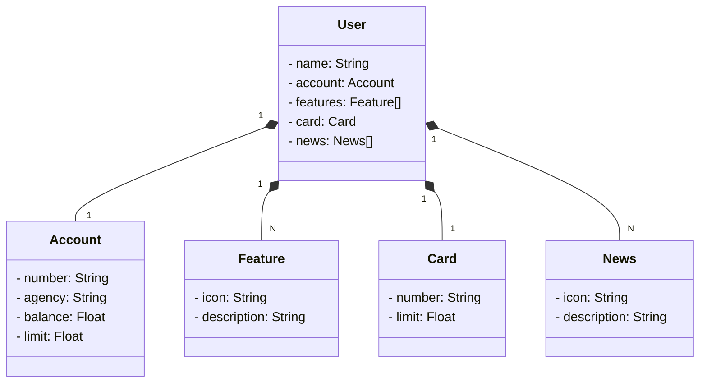

# Projeto Final Bootcamp Santander 2023
Projeto final do Bootcamp Santander com Java API RESTful. 
Utilizando Spring Boot3, Java 17 e Railway.

## Diagrama de Classes

```mermaid

classDiagram
    class User {
        - name: String
        - account: Account
        - features: Feature[]
        - card: Card
        - news: News[]
    }
    
    class Account {
        - number: String
        - agency: String
        - balance: Float
        - limit: Float
    }
    
    class Feature {
        - icon: String
        - description: String
    }
    
    class Card {
        - number: String
        - limit: Float
    }
    
    class News {
        - icon: String
        - description: String
    }
    
    User "1" *-- "1" Account
    User "1" *-- "N" Feature
    User "1" *-- "1" Card
    User "1" *-- "N" News
```
